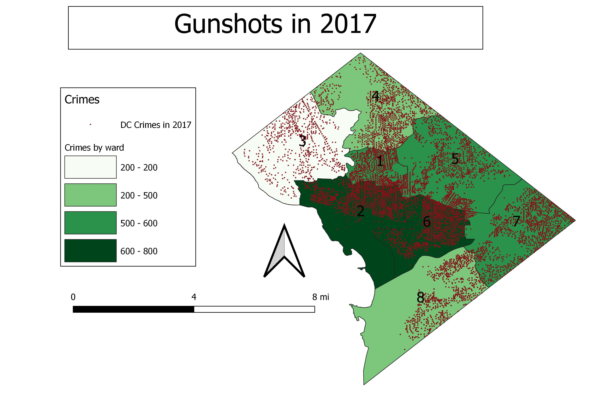
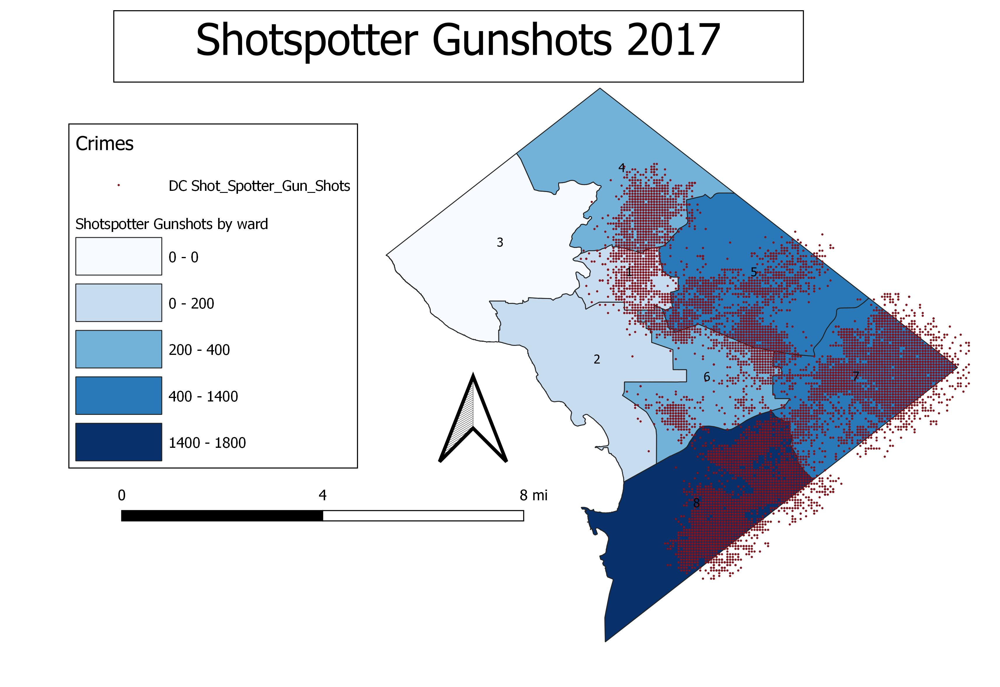

# Final_GEOG682

Shotspotter sensor expansion analysis
May 8th 2020
Robert Klara

## Introduction

In order for the District police to best detect gunshots in the District boundaries, it is to compare the Crime gunshots recorded by
police personnel with the shotspotter detection points to see potential expansion into additional wards for increasing shotspotter
coverage. To do so,  maps showing gunshots per 10k people will be created and comparison the two maps for my analysis for the best ward.
furthermore, an automated tasker for the District police going forward to perform this analysis on a given time interval to compound the
results and make a decision themselves.

## Analysis

### Data selected:

Crimes reported in 2017 - This dataset compiles the crimes for the year 2017 from the ASAP (Analytical Services Application) crime 
report
database from the  DC Metropolitan Police Department (MPD) from opendata.dc.gov

Wards in 2012 - This is a compiled boundary of the wards from 2012 from the DC opendata.dc.gov

Shotspotter Gun shots - This is a compiled result of t he shotspotter acoustic sensors throughout the coverage area in the District of 
Columbia, This is based on triangualtions of 3 sensors to detect locational whereabouts of gunfires to notify law enforcement. 

### Two Maps:
I created my maps by overlaying the actualy crime data on top of chloropleth maps of crimes per 10,000 people. This allows visualization 
of the crime itself alongside the totals present in each distrct in comparison with neighboring ward classes. 

### Crimes reported by police:

Ward 1 - 620 Gunshots per 10k

Ward 2 - 776 gunshots per 10k

Ward 3 - 200 gunshots per 10k

Ward 4 - 381 gunshots per 10k

Ward 5 - 644 gunshots per 10k

Ward 6 - 724 gunshots per 10k

Ward 7 - 600 gunshots per 10k

Ward 8 - 465 gunshots per 10k

### Crimes Detected by spotshotter:

Ward 1 - 210 gunshots per 10k

Ward 2 - 7 gunshots per 10k

Ward 3 - 0 gunshots per 10k

Ward 4 - 365 gunshots per 10k

Ward 5 - 521 gunshots per 10k

Ward 6 - 299 gunshots per 10k

Ward 7 - 1352 gunshots per 10k

Ward 8 - 1773 gunshots per 10k

## Automation

In order to support the districts ongoing determination of which ward would be best for expanded coverage of the Shotspotter, it is 
imperative to automate this process for the  seamless analysis by DC Police officials. 

processing.run("qgis:joinbylocationsummary",
{'INPUT':WardsDC,'JOIN':CrimeDC,'PREDICATE':1,'SUMMARIES':0,'OUTPUT':"S:/682/Spring20/rklara/Final 
Project/682_final_data/Crime_Wardsjoin.shp"})

processing.run("qgis:joinbylocationsummary",
{'INPUT':WardsDC,'JOIN':ShotspotterDC,'PREDICATE':1,'SUMMARIES':0,'OUTPUT':"S:/682/Spring20/rklara/Final 
Project/682_final_data/Shotspotter_Wardsjoin.shp"})

### The Code above joins the respective crime layers tothe Wards based on their spatial ocation. This allows for comparison of crimes by 
### ward. 

expression1 = QgsExpression('"CCN_count"/"POP_2010"*10000')
context = QgsExpressionContext()
context.appendScopes(\
QgsExpressionContextUtils.globalProjectLayerScopes(Crime_Wardsjoin1))

### This line of code creates the expression in order to calculate the crimes per 10k people. 

with edit(Crime_Wardsjoin1):
    for f in Crime_Wardsjoin1.getFeatures():
        context.setFeature(f)
        f['Per10k'] = expression1.evaluate(context)
        Crime_Wardsjoin1.updateFeature(f)
        
### This final line of code actually adds the expressions and updates the specified filed that stores the ratio value of crime per 10k people. 

## Results

There are some major drawbacks I discovered mostly at the finish line of my project.

1. Shotspotter Data - I found out that the 'DATE' field included dates outside the range specified in the instructions. For this reason, I do not have an accurate count forthis field. This would be fixed by selecting fields within the year range of 2017

2. Crimes in 2017 Data - Same here, I found out this data did not contain "solely Gunshot" related data. I would have filtered out all other crime types for this analysis.

3. Finally, With WArds in 2012, Population data in 2010, and Crime and Shotspotter data from 2017, The temporal difference in datasets may play a significant role in error of accuracy.
